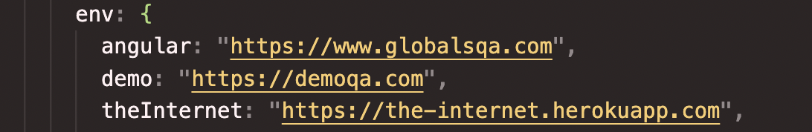
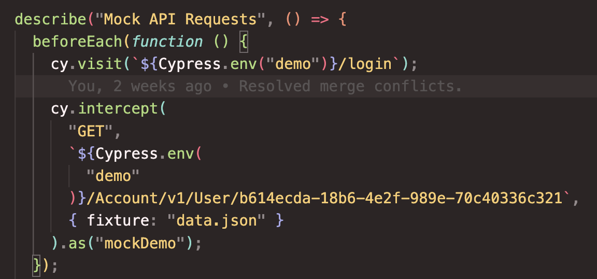
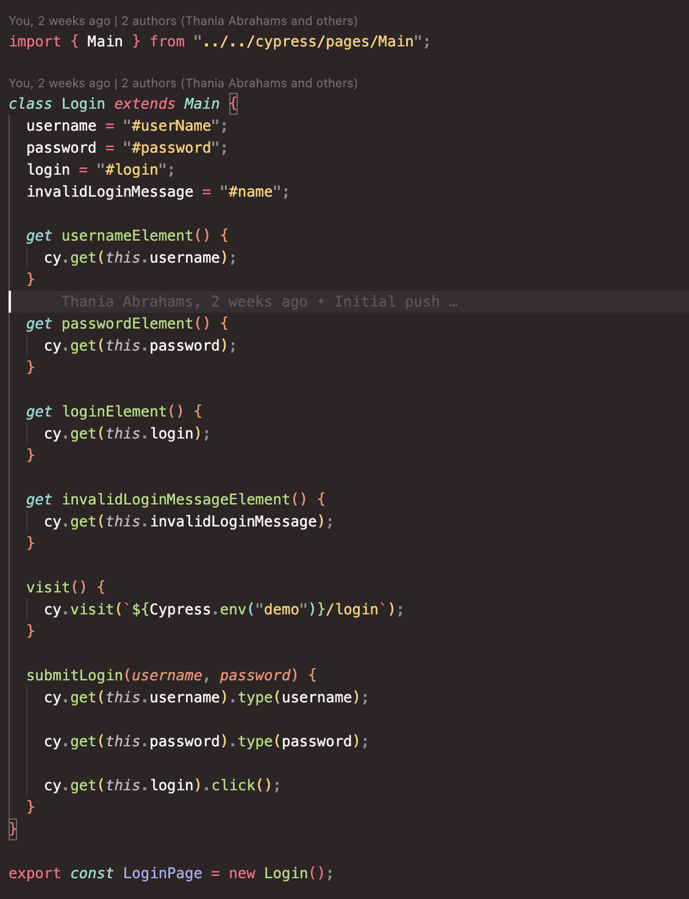

# Starter Project for Writing Test Suites Using Cypress

I created this project to be used as scaffolding when writing tests for use cases that I deemed useful. The project utilizes various public testing platforms for redundancy, namely:

  

## Review of Principal Directories and/or Files

<ul>
  <li>cypress/e2e/case-studies.cy</li>
  <li>cypress/fixtures/data.json</li>
  <li>cypress/pages</li>
  <li>cypress/reports</li>
  <li>cypress/support</li>
  <li>cypress.config.js</li>
  <li>package.json</li>
</ul>

### cypress/e2e/case-studies.cy

We begin with an e2e test using the "Cura Make An Appointment" page, that takes you through various ui interactions from logging in to submitting a form.
I then cover various common use cases such as:

1. Tricks with checkboxes
2. Viewport specification and responsiveness
3. API interceptions
4. testing for broken images
5. iFrames and WYSIWYG editors
6. Database testing
7. API testing
8. Future assertion tests
9. Drag and drop
10. Date pickers etc.

  

A few of these test suites require external plugins to run, you can find them inside of the "package.json" file.

### cypress/fixtures/data.json
You can use fixtures to store sets of data ie. json objects, images, mp3s etc. and than access them when needed. Below is an example of using a fixture to intercept an API request:
  

  

### cypress/pages

  

  

### cypress/reports
Reports are where the Mocha Awesome reports are stored, videos and screenshots should this flag be set to TRUE, will be under the Screenshots and Videos directories.

### cypress/support

### cypress.config.js

### package.json
