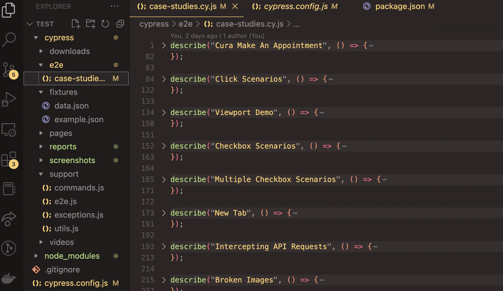

# Starter Project for Writing Test Suites Using Cypress

I created this project to learn and also to be used as scaffolding when writing tests for use cases that I deemed useful.

## A Review of the Most Important Sections

<ul>
  <li style={color: light-blue}>cypress/e2e/case-studies.cy</li>
  <li style={color: light-blue}>package.json</li>
  <li style={color: light-blue}>cypress.config.js</li>
</ul>

The package.json file has a list of additional plugins that I installed to have certain test suites run
The cypress.config

Test Suites for the following scenarios

  

Namely test suites for tricky situaiotn with checboxes, uerwoiert demos, file uploads and downloads
