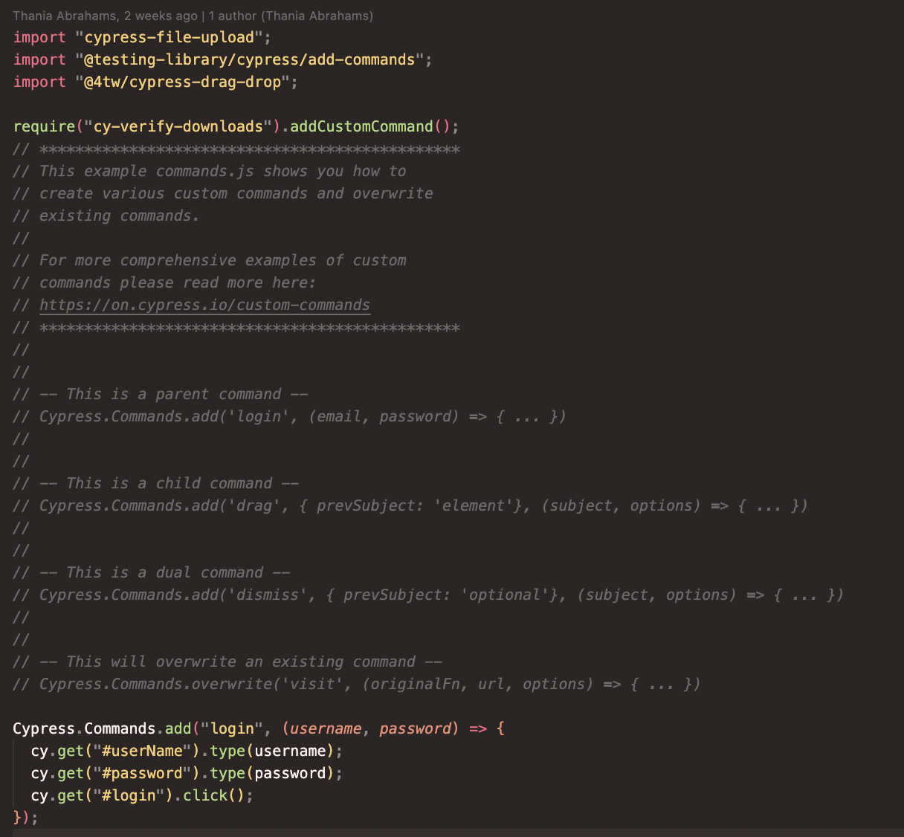

# Starter Project for Writing Test Suites Using Cypress

I created this project to be used as scaffolding when writing tests for use cases that I deemed useful. The project utilizes various public testing platforms for redundancy, namely:

<div align="center">
  
</div>


## Review of Principal Directories and/or Files

<ul>
  <li>cypress/e2e/case-studies.cy</li>
  <li>cypress/fixtures/data.json</li>
  <li>cypress/pages</li>
  <li>cypress/reports</li>
  <ul>cypress/support
    <li>cypress/support/commands.js</li>
    <li>cypress/support/e2e.js</li>
    <li>cypress/support/exceptions.js</li>
    <li>cypress/support/utils.js</li>
  </ul>
  <li>cypress.config.js</li>
  <li>package.json</li>
</ul>


## cypress/e2e/case-studies.cy

We begin with an e2e test using the "Cura Make An Appointment" page, that takes you through various ui interactions from logging in to submitting a form.
I then cover various common use cases such as:
<br />
```
1. Tricks with checkboxes
2. Viewport specification and responsiveness
3. API interceptions
4. testing for broken images
5. iFrames and WYSIWYG editors
6. Database testing
7. API testing
8. Future assertion tests
9. Drag and drop
10. Date pickers etc.
```
<br />
<div align="center">
  
</div>
<br />
A few of these test suites require external plugins to run, you can find them inside of the "package.json" file.


## cypress/fixtures/data.json

You can use fixtures to store sets of data ie. json objects, images, mp3s etc. and than access them when needed. Below is an example of using a fixture to intercept an API request:
  
<div align="center">
  
</div>


## cypress/pages

The Pages directory makes use of the Page Object Model wherein you can create classes that contain all relevant elements that are relevant to a page. For eg. the Login Page will include access to ui elements, methods and data sets:

<div align="center">
  
</div>

Or can make use of Custom Commands, it is really just a matter of preference. POM keeps things more organized whereas Custom Commands, imo, are simpler and quicker to use.

<div align="center">
  
</div>


### cypress/reports

Reports are where the Mocha Awesome reports are stored, videos are included should this flag be set to TRUE. If any tests fail, a screenshot will be made available.

```yarn add -D cypress-mochawesome-reporter```

```https://www.npmjs.com/package/cypress-mochawesome-reporter``` for cypress.config.js instructions

```cypress run``` and not the ```cypress open``` command for automatic reports to run

If all tests pass, you will find an html report inside of the reports directory. Open the report and right click to open with live server, and it will open up a view in a new tab. Please see below for an illustration:

<br />
<div align="center">
  
</div>
<br />


### cypress/support
-------------------

### cypress.config.js
---------------------

### package.json
----------------
